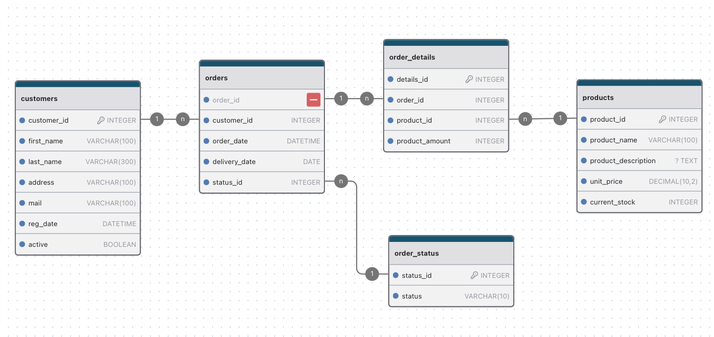

# Tienda Fácil - Gestión de Clientes y Pedidos

---

## Índice

1. [Descripción del Proyecto](#descripción-del-proyecto)
2. [Requisitos de la Aplicación](#requisitos-de-la-aplicación)
3. [Equipo de Trabajo](#equipo-de-trabajo)
4. [Especificaciones Técnicas](#especificaciones-técnicas)
   1. [Backend](#backend)
   2. [Frontend (En Desarrollo)](#frontend-en-desarrollo)
   3. [Herramientas Adicionales](#herramientas-adicionales)
5. [Documentación de la Base de Datos](#documentación-de-la-base-de-datos)
   1. [Diagrama E/R](#diagrama-er)
   2. [Paso a Tabla](#paso-a-tabla)
   3. [Diccionario de Datos](#diccionario-de-datos)
      1. [Tablas](#tablas)
      2. [Funciones](#funciones)
      3. [Triggers](#triggers)
      4. [Procedimientos Almacenados](#procedimientos-almacenados)
      5. [Eventos](#eventos)
   4. [Relaciones entre Tablas](#relaciones-entre-tablas)
   5. [Notas Técnicas](#notas-técnicas)

---

## Descripción del Proyecto

**Tienda Fácil** es un proyecto colaborativo originado en el Discord de **Bytes Colaborativos** con el objetivo de diseñar e implementar un sistema de gestión que permita el registro y administración de clientes y pedidos.

Este sistema busca facilitar a los empleados el acceso a información de clientes y pedidos activos y pendientes, registrar nuevos pedidos para clientes y realizar todas las acciones necesarias para administrar un comercio en línea de manera eficiente.

[Regresar al Índice](#índice)

---

## Requisitos de la Aplicación

1. **Gestión de Clientes**: Registrar, actualizar y consultar la información de clientes.
2. **Gestión de Pedidos**: Registrar, actualizar, consultar y eliminar pedidos vinculados a clientes.
3. **Generación de Reportes**: Elaboración de informes de clientes activos y pedidos pendientes.
4. **Paginación**: Implementar paginación en las listas de clientes y pedidos.
5. **Búsqueda y Filtros**: Habilitar búsquedas y filtros avanzados para clientes y pedidos.
6. **Validación de Formularios**: Aplicar validaciones en todas las secciones de entrada de datos.

[Regresar al Índice](#índice)

---

## Equipo de Trabajo

- **Líder de Equipo**: **Alejandro López**

  Coordinación y supervisión del proyecto, revisión de código y organización del trabajo en equipo.

- **Desarrolladores Backend**: **Didier Maldonado** y **Alejandro López**

  Desarrollo de la API REST e implementación de la base de datos.

- **Desarrollador Frontend**: **Martín Canguillén**

  Creación de la interfaz de usuario y diseño de una experiencia fluida.

- **Documentación y Testing**: **Jacinto Castillo** y **Luis Martínez**

  Elaboración de la documentación del proyecto y realización de pruebas funcionales y de integración.

[Regresar al Índice](#índice)

---

## Especificaciones Técnicas

### Backend

- **Lenguaje**: Java 17
- **Framework**: Spring Boot
- **Base de Datos**: MySQL
- **Gestor de Dependencias**: Maven
- **Dependencias Principales**:
  - Spring Web
  - Spring Data JPA
  - MySQL Connector
  - Spring Boot Validation
  - Lombok
  - Spring Boot DevTools

### Frontend (En Desarrollo)

- **Framework**: Angular o React (a definir según las habilidades del equipo)
- **Componentes Principales**:
  - **Registro de Clientes**: Formulario para agregar nuevos clientes.
  - **Lista de Clientes**: Vista con opciones de edición y eliminación de clientes.
  - **Registro de Pedidos**: Visualización y gestión de pedidos con opciones de devoluciones.
  - **Reportes**: Vista para clientes activos y pedidos por clientes.

### Herramientas Adicionales

- **Gestión de Tareas y Comunicación**:
  - **Trello**: Para organizar el flujo de trabajo.
  - **Discord**: Comunicación en tiempo real y reuniones semanales.

- **Control de Versiones**:
  - **GitHub**: Repositorio del proyecto y manejo de ramas.

- **Documentación**:
  - **Writerside**: Para la elaboración del README.md y demás documentación del proyecto.
  - **Diagrams.net**: Para la creación de diagramas de flujo y diagramas E/R.

[Regresar al Índice](#índice)

---

## Documentación de la Base de Datos

### Diagrama E/R



[Regresar al Índice](#índice)

---

### Paso a Tabla

- **Tabla `customers`**: Almacena la información de los clientes.
  - **Columnas**:
    - `customer_id` (INTEGER, AUTO_INCREMENT, PK): Identificador único del cliente.
    - `first_name` (VARCHAR(100), NOT NULL): Nombre del cliente.
    - `last_name` (VARCHAR(300), NOT NULL): Apellido del cliente.
    - `address` (VARCHAR(100), NOT NULL): Dirección del cliente.
    - `mail` (VARCHAR(100), NOT NULL): Correo electrónico.
    - `reg_date` (DATETIME, NOT NULL, DEFAULT CURRENT_TIMESTAMP): Fecha de registro del cliente.
    - `active` (BOOLEAN, NOT NULL): Indica si el cliente está activo o inactivo.

- **Tabla `order_status`**: Define los estados disponibles para los pedidos.
  - **Columnas**:
    - `status_id` (INTEGER, AUTO_INCREMENT, PK): Identificador único del estado.
    - `status` (VARCHAR(10), NOT NULL, UNIQUE): Nombre del estado (p. ej., Pendiente, Enviado, Entregado).

- **Tabla `products`**: Contiene la información de los productos disponibles.
  - **Columnas**:
    - `product_id` (INTEGER, AUTO_INCREMENT, PK): Identificador único del producto.
    - `product_name` (VARCHAR(100), NOT NULL): Nombre del producto.
    - `product_description` (TEXT, NULL): Descripción del producto.
    - `unit_price` (DECIMAL(10, 2), NOT NULL): Precio unitario del producto.
    - `current_stock` (INTEGER, NOT NULL, DEFAULT 0): Cantidad de stock disponible.

- **Tabla `orders`**: Almacena los pedidos realizados por los clientes.
  - **Columnas**:
    - `order_id` (INTEGER, AUTO_INCREMENT, PK): Identificador único del pedido.
    - `customer_id` (INTEGER, NOT NULL, FK): Referencia al cliente que realizó el pedido (`customers.customer_id`).
    - `order_date` (DATETIME, NOT NULL, DEFAULT CURRENT_TIMESTAMP): Fecha en que se realizó el pedido.
    - `delivery_date` (DATE, NOT NULL): Fecha estimada de entrega.
    - `status_id` (INTEGER, NOT NULL, DEFAULT 1, FK): Estado actual del pedido (`order_status.status_id`).

- **Tabla `order_details`**: Contiene los detalles de los productos incluidos en cada pedido.
  - **Columnas**:
    - `details_id` (INTEGER, AUTO_INCREMENT, PK): Identificador único del detalle.
    - `order_id` (INTEGER, NOT NULL, FK): Referencia al pedido (`orders.order_id`).
    - `product_id` (INTEGER, NOT NULL, FK): Referencia al producto (`products.product_id`).
    - `product_amount` (INTEGER, NOT NULL): Cantidad del producto solicitada en el pedido.
  - **Reglas de Eliminación**:
    - `ON DELETE CASCADE`: Los detalles se eliminan automáticamente si se elimina el pedido asociado.

- **Función `is_recent_order`**: Comprueba si una fecha de pedido es reciente.
  - **Parámetros**:
    - `order_date` (DATETIME): Fecha del pedido.
  - **Retorna**: BOOLEAN.
  - **Uso**: Utilizada en triggers y procedimientos para evaluar si un pedido es reciente.

- **Trigger `activate_customer_on_order`**: Activa al cliente al realizar un pedido reciente.
  - **Evento**: AFTER INSERT ON `orders`.
  - **Acción**: Actualiza `customers.active` a TRUE.

- **Trigger `deactivate_customer_on_order_delete`**: Desactiva al cliente si no tiene pedidos recientes al eliminar un pedido.
  - **Evento**: AFTER DELETE ON `orders`.
  - **Acción**: Actualiza `customers.active` a FALSE si corresponde.

- **Procedimiento `set_customers_inactive`**: Desactiva clientes sin pedidos recientes.
  - **Parámetros**: Ninguno.
  - **Acción**: Actualiza `customers.active` a FALSE para clientes sin pedidos en los últimos 14 días.

- **Evento `deactivate_inactive_customers`**: Programa la desactivación diaria de clientes inactivos.
  - **Frecuencia**: Diaria.
  - **Acción**: Ejecuta `set_customers_inactive`.

[Regresar al Índice](#índice)

### Diccionario de Datos

#### Tablas

##### **Tabla: `customers`** - *Información de clientes*

| **Nombre de la Columna** |     **Tipo de Dato**      |             **Restricciones**             | **Descripción**                                    |
|:-------------------------|:-------------------------:|:-----------------------------------------:|:---------------------------------------------------|
| `customer_id`            |  INTEGER, AUTO_INCREMENT  |                    PK                     | Identificador único del cliente.                   |
| `first_name`             |       VARCHAR(100)        |                 NOT NULL                  | Nombre del cliente.                                |
| `last_name`              |       VARCHAR(300)        |                 NOT NULL                  | Apellido del cliente.                              |
| `address`                |       VARCHAR(100)        |                 NOT NULL                  | Dirección del cliente.                             |
| `mail`                   |       VARCHAR(100)        |                 NOT NULL                  | Correo electrónico del cliente.                    |
| `reg_date`               |         DATETIME          |    NOT NULL, DEFAULT CURRENT_TIMESTAMP    | Fecha de registro.                                 |
| `active`                 |          BOOLEAN          |                 NOT NULL                  | Indica si el cliente está activo.                  |

---

##### **Tabla: `order_status`** - *Estados del pedido*

| **Nombre de la Columna** |    **Tipo de Dato**     | **Restricciones** | **Descripción**                                              |
|:-------------------------|:-----------------------:|:-----------------:|:-------------------------------------------------------------|
| `status_id`              | INTEGER, AUTO_INCREMENT |        PK         | Identificador único del estado.                              |
| `status`                 |       VARCHAR(10)       | NOT NULL, UNIQUE  | Descripción del estado (ej.: Pendiente, Enviado, Entregado). |

---

##### **Tabla: `products`** - *Información de productos disponibles*

| **Nombre de la Columna** |     **Tipo de Dato**      |             **Restricciones**             | **Descripción**                                    |
|:-------------------------|:-------------------------:|:-----------------------------------------:|:---------------------------------------------------|
| `product_id`             |  INTEGER, AUTO_INCREMENT  |                    PK                     | Identificador único del producto.                  |
| `product_name`           |       VARCHAR(100)        |                 NOT NULL                  | Nombre del producto.                               |
| `product_description`    |           TEXT            |                                           | Descripción del producto.                          |
| `unit_price`             |      DECIMAL(10, 2)       |                 NOT NULL                  | Precio unitario del producto.                      |
| `current_stock`          |          INTEGER          |            NOT NULL, DEFAULT 0            | Cantidad en stock.                                 |

---

##### **Tabla: `orders`** - *Registro de pedidos de clientes*

| **Nombre de la Columna** |    **Tipo de Dato**     |                 **Restricciones**                  | **Descripción**                              |
|:-------------------------|:-----------------------:|:--------------------------------------------------:|:---------------------------------------------|
| `order_id`               | INTEGER, AUTO_INCREMENT |                         PK                         | Identificador único del pedido.              |
| `customer_id`            |         INTEGER         |       NOT NULL, FK (`customers.customer_id`)       | Referencia al cliente que realizó el pedido. |
| `order_date`             |        DATETIME         |        NOT NULL, DEFAULT CURRENT_TIMESTAMP         | Fecha en que se realizó el pedido.           |
| `delivery_date`          |          DATE           |                      NOT NULL                      | Fecha de entrega prevista.                   |
| `status_id`              |         INTEGER         | NOT NULL, DEFAULT 1, FK (`order_status.status_id`) | Estado actual del pedido.                    |

---

##### **Tabla: `order_details`** - *Detalle de productos en los pedidos*

| **Nombre de la Columna** |     **Tipo de Dato**      |             **Restricciones**             | **Descripción**                                    |
|:-------------------------|:-------------------------:|:-----------------------------------------:|:---------------------------------------------------|
| `details_id`             |  INTEGER, AUTO_INCREMENT  |                    PK                     | Identificador único del detalle.                   |
| `order_id`               |          INTEGER          |     NOT NULL, FK (`orders.order_id`)      | Referencia al pedido asociado.                     |
| `product_id`             |          INTEGER          |   NOT NULL, FK (`products.product_id`)    | Referencia al producto incluido.                   |
| `product_amount`         |          INTEGER          |                 NOT NULL                  | Cantidad del producto en el pedido.                |

**Reglas de Eliminación:**

- `ON DELETE CASCADE` en `order_details.order_id`: Los detalles se eliminan automáticamente si se elimina el pedido asociado.

[Regresar al Índice](#índice)

---

#### Funciones

##### **Función: `is_recent_order`**

- **Descripción**: Determina si una fecha de pedido es reciente (últimos 14 días).
- **Parámetros**:
  - `order_date` (DATETIME): Fecha del pedido a evaluar.
- **Retorna**: BOOLEAN (TRUE si el pedido es reciente, FALSE en caso contrario).
- **Código:**

```sql
DELIMITER $$
CREATE FUNCTION `is_recent_order`(order_date DATETIME)
RETURNS BOOLEAN
BEGIN
    RETURN order_date >= DATE_SUB(CURRENT_DATE, INTERVAL 14 DAY);
END $$
DELIMITER ;
```

[Regresar al Índice](#índice)

---

#### Triggers

##### **Trigger: `activate_customer_on_order`**

- **Descripción**: Al insertar un nuevo pedido, activa al cliente si el pedido es reciente.
- **Evento**: AFTER INSERT ON `orders`
- **Acción**:
  - Actualiza `customers.active` a TRUE para el `customer_id` del nuevo pedido si este es reciente.
- **Código:**

```sql
DELIMITER $$
CREATE TRIGGER `activate_customer_on_order`
AFTER INSERT ON `orders`
FOR EACH ROW
BEGIN
    UPDATE `customers`
    SET `active` = TRUE
    WHERE `customer_id` = NEW.`customer_id`
      AND is_recent_order(NEW.`order_date`);
END $$
DELIMITER ;
```

---

##### **Trigger: `deactivate_customer_on_order_delete`**

- **Descripción**: Al eliminar un pedido, desactiva al cliente si no tiene más pedidos recientes.
- **Evento**: AFTER DELETE ON `orders`
- **Acción**:
  - Comprueba si el cliente tiene otros pedidos recientes.
  - Si no tiene, actualiza `customers.active` a FALSE.
- **Código:**

```sql
DELIMITER $$
CREATE TRIGGER `deactivate_customer_on_order_delete`
AFTER DELETE ON `orders`
FOR EACH ROW
BEGIN
    DECLARE recent_customer_orders INTEGER;
    SELECT COUNT(`order_id`) INTO recent_customer_orders
    FROM `orders`
    WHERE `customer_id` = OLD.`customer_id`
      AND is_recent_order(`order_date`);

    IF recent_customer_orders = 0 THEN
        UPDATE `customers`
        SET `active` = FALSE
        WHERE `customer_id` = OLD.`customer_id`;
    END IF;
END $$
DELIMITER ;
```

[Regresar al Índice](#índice)

---

#### Procedimientos Almacenados

##### **Procedimiento: `set_customers_inactive`**

- **Descripción**: Desactiva a los clientes que no han realizado pedidos en los últimos 14 días.
- **Parámetros**: Ninguno.
- **Acción**:
  - Actualiza `customers.active` a FALSE para clientes activos sin pedidos recientes.
- **Código:**

```sql
DELIMITER $$
CREATE PROCEDURE `set_customers_inactive`()
BEGIN
    UPDATE `customers`
    SET `active` = FALSE
    WHERE `active` = TRUE
      AND `customer_id` NOT IN (
          SELECT DISTINCT `customer_id`
          FROM `orders`
          WHERE is_recent_order(`order_date`)
      );
END $$
DELIMITER ;
```

[Regresar al Índice](#índice)

---

#### Eventos

##### **Evento: `deactivate_inactive_customers`**

- **Descripción**: Ejecuta diariamente el procedimiento `set_customers_inactive` para desactivar clientes inactivos.
- **Programación**:
  - **Frecuencia**: Cada 1 día.
  - **Inicio**: `CURRENT_TIMESTAMP` (momento actual).
- **Acción**:
  - Llama al procedimiento `set_customers_inactive`.
- **Código:**

```sql
DELIMITER $$
CREATE EVENT `deactivate_inactive_customers`
ON SCHEDULE EVERY 1 DAY STARTS CURRENT_TIMESTAMP
DO
BEGIN
    CALL `set_customers_inactive`();
END $$
DELIMITER ;
```

[Regresar al Índice](#índice)

---

### Relaciones entre Tablas

| **Relación**               | **Origen**      | **Destino**              | **Tipo de Relación**  | **Descripción**                                                               |
|:---------------------------|:----------------|:-------------------------|:---------------------:|:------------------------------------------------------------------------------|
| `orders.customer_id`       | `orders`        | `customers.customer_id`  |          FK           | Un pedido pertenece a un cliente. Un cliente puede tener múltiples pedidos.   |
| `orders.status_id`         | `orders`        | `order_status.status_id` |          FK           | Un pedido tiene un estado.                                                    |
| `order_details.order_id`   | `order_details` | `orders.order_id`        | FK, ON DELETE CASCADE | Cada detalle pertenece a un pedido. Un pedido puede tener múltiples detalles. |
| `order_details.product_id` | `order_details` | `products.product_id`    |          FK           | Cada detalle se asocia con un producto.                                       |

[Regresar al Índice](#índice)

---

#### Explicación de las Relaciones

##### 1. **`orders` ➡️ `customers`**

- **Relación**: Cada pedido está asociado a un cliente en la tabla `customers`.
- **Clave Foránea**: `orders.customer_id` referencia a `customers.customer_id`.
- **Restricciones**:
  - Un pedido no puede existir sin un cliente válido.
  - La eliminación de un cliente no elimina sus pedidos asociados.

---

##### 2. **`orders` ➡️ `order_status`**

- **Relación**: Cada pedido tiene un estado definido en `order_status`.
- **Clave Foránea**: `orders.status_id` referencia a `order_status.status_id`.
- **Restricciones**:
  - Un pedido debe tener un estado válido.
  - La eliminación de un estado no afecta a los pedidos asociados.

---

##### 3. **`order_details` ➡️ `orders`**

- **Relación**: Los detalles están vinculados a un pedido específico.
- **Clave Foránea**: `order_details.order_id` referencia a `orders.order_id`.
- **Restricciones**:
  - Los detalles se eliminan automáticamente si se elimina el pedido asociado (`ON DELETE CASCADE`).

---

##### 4. **`order_details` ➡️ `products`**

- **Relación**: Cada detalle está asociado a un producto en `products`.
- **Clave Foránea**: `order_details.product_id` referencia a `products.product_id`.
- **Restricciones**:
  - Un detalle no puede existir sin un producto válido.
  - La eliminación de un producto no elimina los detalles asociados.

[Regresar al Índice](#índice)

---

### Notas Técnicas

- **Integridad Referencial**: Uso de claves foráneas para mantener la consistencia de los datos entre tablas.
- **Optimización**: Índices automáticos en claves primarias y foráneas para mejorar el rendimiento en consultas.
- **Estándares**: Nomenclatura coherente y uso de estándares SQL para garantizar la mantenibilidad y escalabilidad.
- **Eliminación en Cascada**: Implementada en `order_details` para mantener la integridad al eliminar pedidos.
- **Funciones y Triggers**:
  - La función `is_recent_order` es clave para determinar si un pedido es reciente. Utilizada por triggers y procedimientos.
  - Los triggers `activate_customer_on_order` y `deactivate_customer_on_order_delete` automatizan el estado de los clientes en función de sus pedidos.
- **Procedimientos Almacenados y Eventos**:
  - El procedimiento `set_customers_inactive` permite desactivar clientes sin actividad reciente.
  - El evento `deactivate_inactive_customers` asegura que esta desactivación se realice diariamente de forma automática.

[Regresar al Índice](#índice)

---